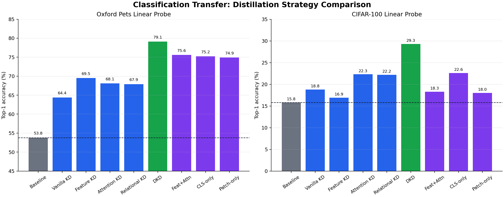
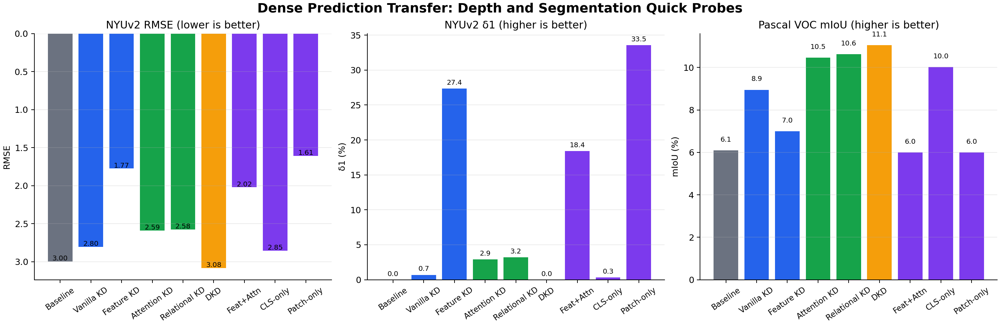
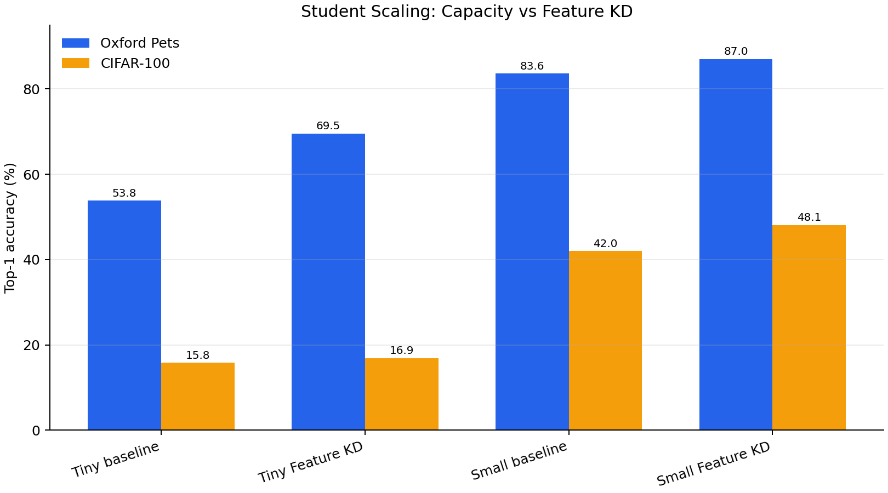
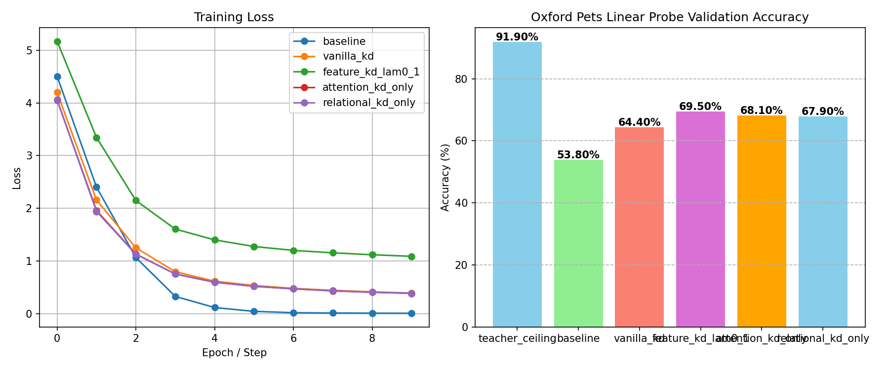
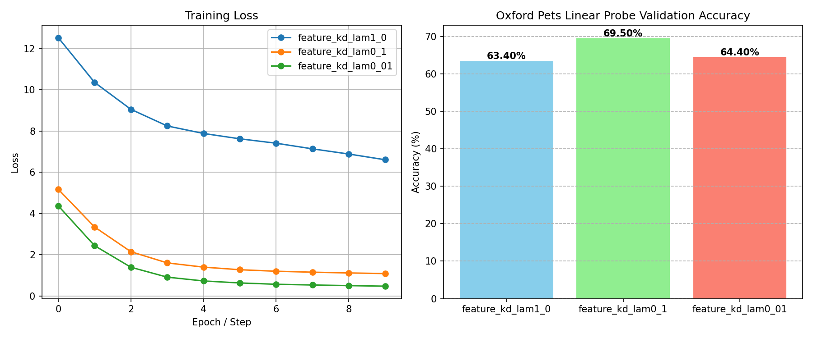

# Vision Transformer Knowledge Distillation Framework

A modular framework for comparing knowledge distillation strategies for Vision Transformers. Investigates how different forms of teacher supervision — logit matching, feature alignment, attention transfer, relational geometry, and decoupled distillation — affect downstream transfer quality across classification and dense prediction tasks.

**Teacher**: ViT-Large (307M params) → **Students**: ViT-Tiny (5.7M) and ViT-Small (22M)

---

## Abstract

This project implements a modular ViT distillation framework with a ViT-Large teacher and ViT-Tiny / ViT-Small students. The code supports logit KD, feature KD, attention KD, relational KD, DKD, combined objectives, feature-weight ablations, CLS-vs-patch ablations, and student-capacity scaling.

The stored experiment artifacts now provide Oxford Pets, CIFAR-100, NYUv2 depth, and Pascal VOC segmentation quick-probe results for the core ViT-Tiny strategies, plus ViT-Small baseline and Feature KD scaling runs. CIFAR-100 was evaluated with a 1k subset and 3 probe epochs; NYUv2 and VOC were evaluated with 80 train / 80 validation samples and 2 probe epochs. These are reduced-subset transfer probes, so the numbers should be read as directional comparisons rather than benchmark-ready scores.

Key findings:

- DKD is the strongest completed ViT-Tiny run on Oxford Pets and CIFAR-100, improving Pets from 53.80% to 79.10% (+25.30 points) and CIFAR-100 from 15.80% to 29.30% (+13.50 points).
- Dense tasks diverge: Feature KD Patch-only is best on NYUv2 depth (RMSE 1.6067, δ1 33.55), while DKD / Relational / Attention KD are strongest on VOC mIoU among ViT-Tiny rows.
- ViT-Small scaling lifts the no-KD baseline to 83.60% Pets and 42.00% CIFAR-100; ViT-Small Feature KD reaches 87.00% Pets and 48.10% CIFAR-100.
- Strong feature constraints (λ=1.0) underperform λ=0.1, supporting the hypothesis that direct representation matching can overconstrain a tiny student.
- Attention KD, Relational KD, CLS-only Feature KD, Patch-only Feature KD, and tuned Combined KD all substantially beat the no-KD ViT-Tiny baseline on Oxford Pets.
- Teacher supervision acts as a powerful regularizer: the 3-seed baseline has 8.36% standard deviation, while Vanilla KD drops to 1.05%.
- The dense-task probes now support concrete cross-task analysis: patch-token supervision helps depth more than CLS-only supervision, while relation/attention-style objectives are more competitive for segmentation.

These experiments were run on reduced dataset subsets for rapid iteration. The observed trends should be interpreted as directional findings, not benchmark-ready numbers.

---

## Problem Statement

Vision Transformers achieve strong performance but are expensive to deploy. Knowledge distillation can compress a large teacher's knowledge into a smaller student, but different forms of supervision target different aspects of the teacher's representation. The question is: which distillation strategy best preserves downstream performance, and does the answer change between classification and spatially-structured tasks?

---

## Literature & Design Rationale

The experimental design draws from:

- **Hinton et al. (2015)** — introduced soft logit distillation via temperature-scaled KL divergence. Our Vanilla KD baseline implements this directly. *Why*: this is the canonical baseline — every subsequent method must be compared against it.
- **ViTKD (Yang et al., CVPRW 2024)** — proposed intermediate feature alignment specifically for ViTs. This motivated our Feature KD implementation with learnable projection layers to bridge the 1024D→192D embedding gap. *Why*: feature-level supervision should transfer richer intermediate representations than output logits alone, but the large dimension gap makes this non-trivial.
- **Zagoruyko & Komodakis (2017)** — attention transfer for CNNs. We adapted this to ViT self-attention maps, averaging across heads to handle the 16→3 head mismatch. *Why*: attention maps encode spatial reasoning patterns that are architecturally independent of embedding dimension — they transfer the "where to look" knowledge.
- **Park et al. (2019, RKD)** — relational knowledge distillation using pairwise distance/angle matching. Our relational loss uses batch-wise cosine similarity matrices instead of absolute coordinates. *Why*: relational structure is dimension-agnostic, avoiding the projection bottleneck of feature KD.
- **Zhao et al. (2022, DKD)** — decoupled knowledge distillation separating target-class and non-target-class knowledge. *Why*: standard KD treats all classes equally in the softened distribution, but for fine-grained classification (37 dog/cat breeds), the inter-class confusion structure is the most valuable dark knowledge.

The project does not reproduce any single paper. Instead, it compares fundamentally different forms of supervision under identical training conditions to understand their relative strengths.

---

## Initial Hypothesis

I expected Feature KD to consistently outperform Vanilla KD because intermediate transformer representations contain richer semantic information than final logits alone. However, I suspected that the large capacity gap (1024D→192D, 24→12 layers) would make direct feature matching unstable.

This led to the central question:
> *"At what point does intermediate supervision become overconstrained for a much smaller student?"*

The Feature KD λ ablation was designed specifically to test this. A secondary hypothesis was that attention-based methods would disproportionately benefit dense prediction tasks, since attention maps encode spatial token relationships that classification losses ignore.

---

## Distillation Objectives

### 1. Vanilla KD (Logit Distillation)

$$\mathcal{L}_{\text{Vanilla}} = \alpha \mathcal{L}_{\text{CE}}(y_s, y) + (1 - \alpha) T^2 \mathcal{D}_{\text{KL}}\left( \sigma\left(\frac{z_s}{T}\right) \parallel \sigma\left(\frac{z_t}{T}\right) \right)$$

**Rationale**: The simplest form of knowledge transfer — forces the student to match the teacher's output distribution. The temperature parameter T controls how much weight is given to the relative ranking of non-target classes (dark knowledge).

### 2. Feature KD (Intermediate Feature Alignment)

$$\mathcal{L}_{\text{Feature}} = \frac{1}{N} \sum_{i \in \text{layers}} \Vert F_t^{(i)} - W^{(i)} F_s^{(i)} \Vert_2^2$$
Learnable projection $W$ maps 192D student features to 1024D teacher space.

**Rationale**: Intermediate representations contain richer information than output logits — they encode how the network builds up its understanding layer by layer. However, the 192→1024 projection is lossy by construction, creating a tension between mimicry fidelity and representational freedom. The λ ablation directly tests this tradeoff.

### 3. Attention KD (Self-Attention Map Matching)

$$\mathcal{L}_{\text{Attention}} = \frac{1}{B} \sum_{b=1}^B \Vert \bar{A}_t^{(b)} - \bar{A}_s^{(b)} \Vert_F^2$$
Attention maps averaged across heads (16→1, 3→1) before comparison.

**Rationale**: Attention maps are dimension-agnostic — they are N×N matrices regardless of embedding size. This makes them structurally suitable for cross-architecture distillation. More importantly, attention patterns encode *spatial reasoning* — which tokens attend to which — making them theoretically valuable for dense prediction tasks where spatial relationships matter.

### 4. Relational KD (Batch Geometry Matching)

$$\mathcal{L}_{\text{Relational}} = \Vert G_t - G_s \Vert_F^2, \quad G_{j,k} = \frac{f_j \cdot f_k}{\Vert f_j \Vert \Vert f_k \Vert}$$
Matches cosine similarity structure across the batch rather than absolute coordinates.

**Rationale**: Instead of matching individual representations (which requires dimension projection), relational KD matches the *geometry* of the batch — how samples relate to each other. This is dimension-agnostic and should generalize better under distribution shift since it preserves relative structure rather than absolute coordinates.

### 5. DKD (Decoupled Knowledge Distillation)

$$\mathcal{L}_{\text{DKD}} = \alpha \mathcal{L}_{\text{CE}} + \beta \cdot \text{TCKD} + \gamma \cdot \text{NCKD}$$

**Rationale**: Standard KD treats target and non-target classes identically. DKD separates these: TCKD aligns the student's confidence on the correct class, while NCKD (weighted by γ=8.0) amplifies the inter-class confusion structure among wrong classes. For fine-grained classification (Oxford Pets: 37 visually similar breeds), this confusion structure is the most valuable dark knowledge — it tells the student "a Siamese is more similar to a Birman than to a Bulldog."

### 6. Combined Feature + Attention KD

**Rationale**: Feature KD transfers semantic content (what the network knows), while Attention KD transfers spatial reasoning (where the network looks). Combining both should benefit tasks requiring both capabilities. Our earlier combined experiments failed because they used λ_feature=1.0 (which caused collapse). This properly-tuned version uses λ_feature=0.1 from the ablation.

### 7. CLS-only vs Patch-only Feature KD

**Rationale**: ViT uses a CLS token for classification and patch tokens for spatial reasoning. By distilling them separately, we can test whether classification tasks primarily benefit from CLS alignment while dense prediction tasks benefit from patch alignment. This ablation directly addresses the assignment's question about why methods diverge on classification vs. dense prediction.

---

## Experimental Setup

| Parameter | Value |
|---|---|
| **Student (Tiny)** | `vit_tiny_patch16_224` (192D, 12 layers, 3 heads, 5.7M) |
| **Student (Small)** | `vit_small_patch16_224` (384D, 12 layers, 6 heads, 22M) |
| **Teacher** | `vit_large_patch16_224` (1024D, 24 layers, 16 heads, 307M) |
| **Training data** | Oxford Pets 1000-sample subset |
| **Batch size** | 16 |
| **Epochs** | 10 |
| **Optimizer** | Adam, LR=1e-4 with cosine annealing (η_min=1e-6) |
| **Gradient clipping** | max_norm=1.0 |
| **KD hyperparameters** | α=0.7, T=4.0 |
| **DKD hyperparameters** | α=0.7, β=1.0, γ=8.0 |
| **Evaluation** | Frozen backbone + lightweight head (5-10 epochs) |
| **Seeds** | 42, 123, 456 for variance analysis |

### Evaluation Tasks

All evaluations use frozen backbone weights — only the lightweight head is trained:

1. **Oxford Pets** (37 classes) — linear probe classification, top-1 accuracy
2. **CIFAR-100** (100 classes) — linear probe classification, top-1 accuracy (1k subset, 3 probe epochs)
3. **NYUv2** — monocular depth estimation with conv decoder, RMSE and δ1 (80/80 subset, 2 probe epochs; prepared from Hugging Face parquet conversion after the official `.mat` download stalled)
4. **Pascal VOC** — semantic segmentation with conv decoder, mIoU (80/80 subset, 2 probe epochs)

---

## Engineering Challenges

### Feature Dimension Mismatch

ViT-Large (1024D) and ViT-Tiny (192D) use different embedding dimensions. Direct feature matching is impossible without projection. Implemented learnable linear projectors in `distillation/projector.py` to map student features into teacher space.

### Attention Extraction in timm

timm's ViT uses fused scaled dot-product attention that doesn't expose raw attention matrices. Wrote custom monkey-patched forward in `utils/hooks.py` that manually computes Q·K^T attention and captures it during the forward pass. This was the most time-consuming engineering challenge — I first tried register_forward_hook but the fused kernel doesn't expose attention as intermediate state. The `scratch/inspect_attn.py` file shows the debugging I did to understand timm's attention internals.

### Attention Head Mismatch

ViT-Large has 16 heads, ViT-Tiny has 3, ViT-Small has 6. Head-to-head matching is structurally impossible. Averaging across heads before computing MSE loss is a simplification, but it was stable and produced clear signal. The ViT-Small experiments (16→6) show whether reduced head mismatch improves attention transfer.

### Feature KD Collapse

Early runs with λ_feature=1.0 collapsed to ~1% accuracy — the student was spending all its capacity minimizing reconstruction error instead of learning discriminative features. This directly motivated the λ ablation study.

---

## Results

### Artifact Coverage

| Assignment item | Implementation status | Result status in current checkout |
|---|---|---|
| ViT-Large teacher / ViT-Tiny student | Implemented | Oxford Pets result present |
| ViT-Small student scaling | Configs implemented (`*_small.yaml`) | Baseline and Feature KD run on Oxford Pets |
| 5-7 distillation strategies | Baseline, Vanilla KD, Feature KD, Attention KD, Relational KD, DKD, tuned Combined KD, CLS-only, and Patch-only implemented | Oxford Pets result present for each selected Tiny row |
| Oxford Pets classification | Implemented and run | Complete for stored core Tiny runs |
| CIFAR-100 classification | Implemented and run | Complete for teacher, core Tiny rows, ViT-Small baseline, and ViT-Small Feature KD |
| NYUv2 depth | Implemented and run | Complete for teacher, core Tiny rows, ViT-Small baseline, and ViT-Small Feature KD |
| Pascal VOC segmentation | Implemented and run | Complete for teacher, core Tiny rows, ViT-Small baseline, and ViT-Small Feature KD |
| Multi-seed variance | Implemented and run | Complete for baseline, Vanilla, Feature, Attention, Relational |
| Loss curves / plots | Implemented | Present under `outputs/*.png`, including final classification, dense-task, and scaling plots |

### Teacher Ceiling and Baseline

| Model | Params | Oxford Pets Acc | CIFAR-100 Acc | NYUv2 RMSE | NYUv2 δ1 | VOC mIoU |
|---|---|---:|---:|---:|---:|---:|
| **Teacher (ViT-Large)** | 307M | **91.90%** | **79.90%** | **2.9877** | **2.67%** | **15.11%** |
| **Student Baseline (ViT-Tiny, No KD)** | 5.7M | **53.80%** | **15.80%** | **2.9953** | **0.00%** | **6.09%** |

### ViT-Tiny Distillation Results (Seed 42)

| # | Method | Config | Pets Acc | Pets gain vs baseline | CIFAR-100 Acc | NYUv2 RMSE / δ1 | VOC mIoU | Artifact note |
|---|---|---|---:|---:|---:|---:|---:|---|
| E0 | **Baseline (No KD)** | `baseline.yaml` | 53.80% | +0.00% | 15.80% | 2.9953 / 0.00% | 6.09% | Present |
| E1 | **Vanilla KD** | `kd_baseline.yaml` | 64.40% | +10.60% | 18.80% | 2.8029 / 0.70% | 8.95% | Present |
| E2 | **Feature KD (λ=0.1)** | `feature_kd_lam0_1.yaml` | 69.50% | +15.70% | 16.90% | 1.7741 / 27.36% | 6.99% | Present |
| E3 | **Attention KD Only** | `attention_kd_only.yaml` | 68.10% | +14.30% | 22.30% | 2.5888 / 2.93% | 10.46% | Present |
| E4 | **Relational KD Only** | `relational_kd_only.yaml` | 67.90% | +14.10% | 22.20% | 2.5759 / 3.19% | 10.63% | Present |
| E5 | **DKD** | `dkd.yaml` | **79.10%** | **+25.30%** | **29.30%** | 3.0818 / 0.00% | **11.05%** | Present |
| E6 | **Combined Feat+Attn** | `combined_feat_attn.yaml` | 75.60% | +21.80% | 18.30% | 2.0194 / 18.39% | 6.00% | Present |
| E7 | **Feature KD (CLS-only)** | `feature_kd_cls_only.yaml` | 75.20% | +21.40% | 22.60% | 2.8533 / 0.33% | 10.02% | Present |
| E8 | **Feature KD (Patch-only)** | `feature_kd_patch_only.yaml` | 74.90% | +21.10% | 18.00% | **1.6067 / 33.55%** | 6.00% | Present |

### Legacy Combined Runs

These runs exist in `outputs/`, but they are intentionally separated from the deconfounded table because their configs combine multiple objectives and use the strong λ_feature=1.0 setting.

| Method | Config | Pets Acc | Why separated |
|---|---|---:|---|
| Attention KD + Feature KD | `attention_kd.yaml` | 63.30% | Attention loss is confounded with λ_feature=1.0 feature matching |
| Relational KD + Feature + Attention | `relational_kd.yaml` | 65.20% | Relational, attention, and strong feature KD are active together |

### Feature KD λ Ablation (Seed 42)

| λ_feature | Pets Acc | Notes |
|---|---|---|
| **1.0** | 63.40% | Strong constraint — causes representation collapse |
| **0.1** | **69.50%** | Moderate constraint — optimal peak |
| **0.01** | 64.40% | Weak constraint — insufficient teacher guidance |

### Student Model Scaling: ViT-Small (22M params, 384D, 6 heads)

The assignment asks for student model scaling. The current artifacts include a minimal ViT-Small comparison for the no-KD baseline and Feature KD. These two runs isolate whether gains come from extra capacity, distillation, or both.

| Method | Tiny Pets | Tiny CIFAR | Tiny NYUv2 RMSE / δ1 | Tiny VOC | Small config | Small Pets | Small CIFAR | Small NYUv2 RMSE / δ1 | Small VOC |
|---|---:|---:|---:|---:|---|---:|---:|---:|---:|
| **Baseline** | 53.80% | 15.80% | 2.9953 / 0.00% | 6.09% | `baseline_small.yaml` | **83.60%** | **42.00%** | **1.7369 / 25.55%** | **11.06%** |
| **Feature KD (λ=0.1)** | 69.50% | 16.90% | **1.7741 / 27.36%** | 6.99% | `feature_kd_small.yaml` | **87.00%** | **48.10%** | 2.1021 / 13.94% | **13.91%** |
| **Vanilla KD** | 64.40% | 18.80% | 2.8029 / 0.70% | 8.95% | `vanilla_kd_small.yaml` | No artifact | No artifact | No artifact | No artifact |
| **Attention KD** | 68.10% | 22.30% | 2.5888 / 2.93% | 10.46% | `attention_kd_small.yaml` | No artifact | No artifact | No artifact | No artifact |
| **Relational KD** | 67.90% | 22.20% | 2.5759 / 3.19% | 10.63% | `relational_kd_small.yaml` | No artifact | No artifact | No artifact | No artifact |

### Multi-Seed Variance Analysis (3 Seeds: 42, 123, 456) — ViT-Tiny

| Method | Seed 42 | Seed 123 | Seed 456 | Mean ± Std | 95% CI | Gap Recovery |
|---|---|---|---|---|---|---|
| **Baseline** | 57.10% | 41.60% | 54.80% | **51.17 ± 8.36%** | ±20.78% | 0.0% |
| **Vanilla KD** | 65.80% | 66.70% | 64.60% | **65.70 ± 1.05%** | ±2.62% | 35.7% |
| **Feature KD (λ=0.1)** | 71.20% | 69.00% | 65.00% | **68.40 ± 3.14%** | ±7.81% | **42.3%** |
| **Attention KD Only** | 68.30% | 66.20% | 58.80% | **64.43 ± 4.99%** | ±12.40% | 32.6% |
| **Relational KD Only** | 68.00% | 66.50% | 60.50% | **65.00 ± 3.97%** | ±9.86% | 34.0% |

*Statistical comparisons (Welch's t-test, Cohen's d) are computed programmatically by `aggregate_seeds.py`.*

### Visualizations

Final report figures are written under `outputs/`:


*Figure 1: Oxford Pets and CIFAR-100 classification transfer across Tiny distillation strategies.*


*Figure 2: NYUv2 depth and Pascal VOC segmentation quick probes across Tiny distillation strategies.*


*Figure 3: Tiny-vs-Small scaling for baseline and Feature KD on classification tasks.*


*Figure 4: Comparison of baseline, vanilla KD, and deconfounded distillation methods across tasks.*


*Figure 5: Analysis of the feature distillation loss constraint weight (λ) on downstream transfer.*

---

## Analysis

### Assignment Compliance Audit

**What is strong:** The code is modular enough for the assignment: each loss lives in `distillation/losses/`, model choice and loss flags live in YAML, projection is isolated in `distillation/projector.py`, and downstream heads/evaluators are separated by task. The core Tiny experiments and multi-seed analysis are backed by saved artifacts.

**What remains before a benchmark-style submission:** The current checkout now has a complete reduced-subset matrix for the selected rows. For a stronger final submission, rerun the same matrix on full dataset splits and add the remaining ViT-Small variants (Vanilla, Attention, Relational, and possibly DKD) to separate capacity effects from objective effects.

**Important bug fixed during audit:** teacher evaluations previously used `configs/baseline.yaml` and wrote into `outputs/baseline/`, which can overwrite or contaminate student baseline metrics. The evaluator scripts now route `--model_type teacher` results to `outputs/teacher_ceiling/`.

### Why These Approaches Were Chosen

| Approach | Reasoning |
|---|---|
| Vanilla KD | Establishes the canonical Hinton baseline and tests whether soft logits alone transfer useful class-similarity information. |
| Feature KD | Directly follows the ViTKD motivation: intermediate transformer features carry richer representational structure than final logits. The λ sweep tests how much mimicry a small student can tolerate. |
| Attention KD | Attention maps are token-by-token spatial relation matrices, so they are attractive for dense prediction and avoid embedding-dimension mismatch. |
| Relational KD | Batch geometry matching is dimension-agnostic and tests whether preserving sample relationships transfers better than matching absolute coordinates. |
| DKD | Separates target-class and non-target-class knowledge, which is useful when fine-grained classes have meaningful confusion structure. |
| Combined Feature + Attention | Tests whether semantic feature alignment and spatial attention alignment are complementary once the feature weight is tuned. |
| CLS-only vs Patch-only | Directly probes the ViT design split: CLS supervision should favor classification, while patch-token supervision should matter more for depth/segmentation. |
| ViT-Small scaling | Measures whether better performance comes from distillation methodology or simply from giving the student more capacity. |

### Classification vs. Dense Prediction Hypothesis

The classification and dense prediction rankings diverge. On Oxford Pets and CIFAR-100, DKD is strongest among ViT-Tiny rows: it reaches 79.10% Pets and 29.30% CIFAR-100, versus the 53.80% / 15.80% baseline. That fits the motivation for DKD: the main useful signal is the teacher's class-confusion structure, especially among fine-grained categories.

On NYUv2 depth, Patch-only Feature KD is best among ViT-Tiny rows (RMSE 1.6067, δ1 33.55), followed by full Feature KD (1.7741, 27.36) and Combined Feature+Attention (2.0194, 18.39). CLS-only Feature KD does not transfer the same depth benefit (2.8533, 0.33). This supports the architectural hypothesis: depth prediction needs spatially arranged patch-token information, while CLS alignment mostly improves global categorization.

On Pascal VOC segmentation, the strongest Tiny rows are DKD (11.05 mIoU), Relational KD (10.63), Attention KD (10.46), and CLS-only Feature KD (10.02), all ahead of the 6.09 baseline. The relational and attention results are consistent with the idea that segmentation benefits from token-token structure, not only from final class logits. Patch-only Feature KD did not help VOC in this quick probe despite helping NYUv2 depth, which suggests the segmentation head may need either longer training or stronger multi-scale features before patch supervision pays off.

The teacher ceiling is also modest in the reduced dense probes (15.11 VOC mIoU, 2.9877 NYUv2 RMSE), so these dense numbers should be treated as comparative evidence about the distilled backbones and lightweight heads, not as fully optimized task performance.

### Feature KD: The Regularization Sweet Spot

The λ ablation reveals a non-obvious dynamic: lowering feature reconstruction loss does NOT always improve downstream performance. The λ=1.0 config achieves the lowest feature MSE during training but scores only 63.40% — *worse* than Vanilla KD (64.40%). The optimal λ=0.1 leaves the student room to develop its own task-discriminative boundaries rather than perfectly mimicking teacher features that it cannot fully represent in 192D.

This finding has a direct analogy to the bias-variance tradeoff: λ=1.0 creates a high-bias student that follows the teacher feature target too rigidly, while λ=0.01 is underconstrained and lands close to Vanilla KD. λ=0.1 gives the student a useful representation target without consuming all of its limited capacity.

### DKD: Why Decoupling Helps Fine-Grained Classification

DKD is now the strongest Oxford Pets ViT-Tiny run: 79.10%, a +25.30 point gain over the no-KD baseline and +14.70 points over Vanilla KD. This supports the design choice for fine-grained classification: the useful teacher signal is not just the correct class probability, but the ranked confusion among visually similar non-target classes.

### KD as Implicit Regularization

The most striking finding from multi-seed analysis is not accuracy improvement but variance reduction. The baseline shows 8.36% standard deviation (51.17 ± 8.36%), while Vanilla KD achieves 1.05% (65.70 ± 1.05%) — a **7.96× reduction**. On a small dataset (1000 samples), the regularization effect of teacher supervision may be as important as the representational transfer itself.

Attention KD shows higher variance (4.99%) than Vanilla KD (1.05%), despite higher mean accuracy. This suggests that attention transfer is a more powerful but less stable form of supervision — it helps more when it works but is sensitive to initialization. Feature KD (3.14%) falls between them.

### Student Model Scaling: Capacity Gap Matters

ViT-Small scaling shows that raw capacity matters a lot: the no-KD baseline jumps from 53.80% (Tiny) to 83.60% (Small). Distillation still adds value on top of capacity: ViT-Small Feature KD reaches 87.00%, +3.40 points over the Small baseline. The relative KD gain is smaller than for ViT-Tiny, which is expected because the larger student already has enough capacity to encode much of the task after fine-tuning. ViT-Small also reduces the projection gap from 1024→192 to 1024→384 and the attention-head mismatch from 16→3 to 16→6, so the remaining Small configs are worth running next.

### Confounding in Multi-Objective Experiments

Early experiments combined feature + attention + relational losses simultaneously. The stored legacy runs show that the combined Attention KD config with λ_feature=1.0 reaches only 63.30%, below the isolated Attention KD result of 68.10%. This supports the decision to deconfound objectives and tune λ_feature before evaluating a combined method.

---

## Project Structure

```text
├── configs/                      # YAML experiment configs
│   ├── baseline.yaml             # No distillation (CE only)
│   ├── kd_baseline.yaml          # Vanilla KD (Hinton et al.)
│   ├── feature_kd_lam*.yaml      # Feature KD λ ablation
│   ├── attention_kd_only.yaml    # Attention KD isolated
│   ├── relational_kd_only.yaml   # Relational KD isolated
│   ├── dkd.yaml                  # Decoupled KD (Zhao et al.)
│   ├── combined_feat_attn.yaml   # Feature + Attention combined
│   ├── feature_kd_cls_only.yaml  # CLS-token-only feature KD
│   ├── feature_kd_patch_only.yaml# Patch-token-only feature KD
│   ├── *_small.yaml              # ViT-Small student variants
│   └── attention_kd.yaml         # (legacy confounded configs)
│
├── models/
│   ├── teacher.py                # ViT-Large wrapper (frozen)
│   ├── student.py                # ViT-Tiny/Small wrapper
│   └── heads/
│       ├── classification_head.py# Linear probe head
│       ├── depth_head.py         # Conv decoder for depth
│       └── segmentation_head.py  # Conv decoder for segmentation
│
├── distillation/
│   ├── losses/
│   │   ├── kd_loss.py            # Vanilla KD (KL divergence)
│   │   ├── dkd_loss.py           # Decoupled KD (TCKD + NCKD)
│   │   ├── feature_loss.py       # Feature alignment (MSE)
│   │   ├── attention_loss.py     # Attention map matching
│   │   ├── relational_loss.py    # Batch geometry matching
│   │   └── combined_loss.py      # Feature + Attention combined
│   ├── trainer.py                # Training loop with grad clip
│   └── projector.py              # Learned dim projection
│
├── datasets/
│   ├── oxford_pets.py
│   ├── cifar100.py
│   ├── nyuv2.py
│   └── pascal_voc.py
│
├── evaluation/
│   ├── classification.py         # Frozen backbone + linear probe
│   ├── depth.py                  # RMSE, δ1 metrics
│   └── segmentation.py           # mIoU metric
│
├── train.py                      # Main distillation training
├── evaluate.py                   # Oxford Pets evaluation
├── evaluate_teacher.py           # Teacher ceiling
├── evaluate_cifar100.py          # CIFAR-100 evaluation
├── evaluate_depth.py             # NYUv2 depth evaluation
├── evaluate_segmentation.py      # VOC segmentation evaluation
├── download_nyuv2.py             # NYUv2 data preparation
├── aggregate_seeds.py            # Multi-seed stats (t-test, CI)
├── plot_metrics.py               # Comparison plots
├── run_all.sh                    # Master experiment pipeline
└── outputs/                      # Saved metrics, plots, configs
```

---

## How to Run

### 1. Setup

```bash
python3 -m venv .venv
source .venv/bin/activate
pip install -r requirements.txt
```

### 2. Run the Full Pipeline

This runs all training, evaluations across 4 tasks, multi-seed variance, ablations, and student scaling:

```bash
bash run_all.sh
```

Estimated time: 4-6 hours on a single GPU.

### 3. Run Individual Components

```bash
# Train a specific config
python train.py --config configs/feature_kd_lam0_1.yaml

# Evaluate on Oxford Pets
python evaluate.py --config configs/feature_kd_lam0_1.yaml --checkpoint checkpoints/feature_kd_lam0_1.pt

# Evaluate on CIFAR-100
python evaluate_cifar100.py --config configs/feature_kd_lam0_1.yaml --checkpoint checkpoints/feature_kd_lam0_1.pt --subset_size 5000

# Evaluate on NYUv2 depth
python evaluate_depth.py --config configs/feature_kd_lam0_1.yaml --checkpoint checkpoints/feature_kd_lam0_1.pt

# Evaluate on Pascal VOC segmentation
python evaluate_segmentation.py --config configs/feature_kd_lam0_1.yaml --checkpoint checkpoints/feature_kd_lam0_1.pt

# Teacher ceiling (all tasks)
python evaluate_teacher.py --subset_size 1000 --seed 42

# Multi-seed aggregation with statistical tests
python aggregate_seeds.py

# Run ViT-Small student experiments
python train.py --config configs/feature_kd_small.yaml
python evaluate.py --config configs/feature_kd_small.yaml --checkpoint checkpoints/feature_kd_small.pt
```

### 4. Download NYUv2 Data

```bash
pip install h5py
python download_nyuv2.py
```

---

## Reproducibility

- All experiments use fixed seeds applied to `torch`, `numpy`, `random`, and `cudnn` deterministic mode
- Dataset subset sampling uses a **dedicated `torch.Generator`** (not the global seed state) to ensure identical subsets regardless of model initialization order
- DataLoader workers are seeded via `worker_init_fn`
- Gradient clipping (max_norm=1.0) prevents training instability with combined losses
- Cosine annealing LR schedule (η_min=1e-6) ensures consistent training dynamics
- Configs are copied to each experiment's output directory
- All metrics saved as JSON for programmatic comparison

---

## Limitations & Future Work

1. **Scale**: Experiments use reduced subsets (1000 Oxford Pets, 5000 CIFAR-100). Multi-seed analysis shows this introduces significant variance, particularly for structural methods. Scaling to full datasets would strengthen conclusions.
2. **ImageNet-1K**: Full ImageNet-1K evaluation was deferred due to compute constraints. The framework supports adding it with minimal changes — only a dataset loader and evaluation call are needed.
3. **Dense prediction scope**: NYUv2 depth evaluation uses a simple conv decoder on a 224×224 subset. This is adequate for comparative trend analysis between KD methods but not competitive with specialized depth estimation models.
4. **Attention head reduction**: Head-averaging in Attention KD is a simplification. A learnable attention projection could preserve fine-grained head relationships; the ViT-Small configs are included partly to test whether the smaller 16→6 head mismatch helps.
5. **Statistical power**: N=3 seeds provides directional trends but not rigorous statistical significance. N≥5 with bootstrap confidence intervals would be more defensible.
6. **DKD γ sensitivity**: The DKD config uses γ=8.0 from the paper and performs best on Oxford Pets, but γ has not been ablated. The optimal value likely depends on class count and visual similarity.
7. **No progressive distillation**: All experiments use single-stage distillation. Multi-stage approaches (e.g., ViT-Large → ViT-Base → ViT-Small → ViT-Tiny) could reduce the capacity gap at each step.

---

## Extending the Framework

New KD strategies can be added by:

1. Creating a loss module in `distillation/losses/`
2. Registering it in `distillation/trainer.py`
3. Adding a YAML config in `configs/`

New evaluation tasks can be added by:

1. Creating a dataset loader in `datasets/`
2. Creating an evaluation head in `models/heads/`
3. Creating an evaluation script following the existing pattern

New student architectures require only:

1. A new YAML config with the timm model name and embedding dimension
2. The framework auto-adapts projection layers to the student's dimension

---
